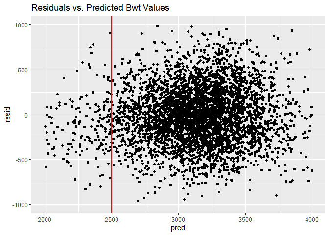
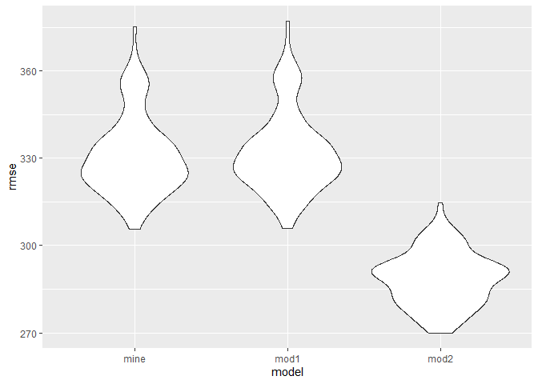
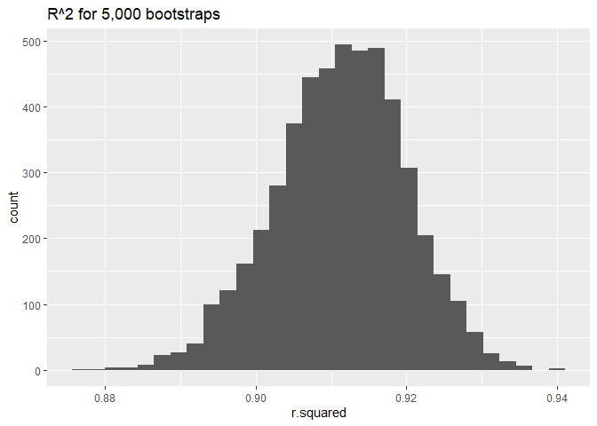
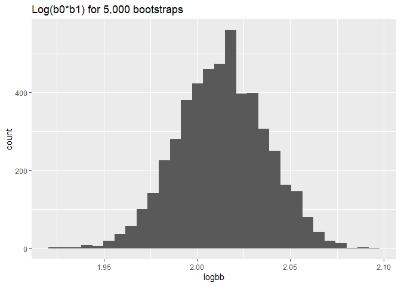

P8105 Homework 6
================
Alison Elgass

``` r
library(tidyverse)
```

    ## -- Attaching packages ------------------------------------ tidyverse 1.2.1 --

    ## v ggplot2 3.2.1     v purrr   0.3.2
    ## v tibble  2.1.3     v dplyr   0.8.3
    ## v tidyr   1.0.0     v stringr 1.4.0
    ## v readr   1.3.1     v forcats 0.4.0

    ## -- Conflicts --------------------------------------- tidyverse_conflicts() --
    ## x dplyr::filter() masks stats::filter()
    ## x dplyr::lag()    masks stats::lag()

``` r
library(modelr)
set.seed(1)
```

# Problem 1

First load and tidy birth weight data.  
Note that the Children’s Hospital of Philadelphia defines low birth
weight as less than 2500 grams (5 lbs 8 oz).

``` r
bwt_data = read_csv(file = "./data/birthweight.csv") %>% 
  mutate(
    babysex = factor(babysex, levels = c(1,2), 
                     labels = c("male","female")),
    frace = factor(frace, levels = c(1,2,3,4,8,9), 
                   labels = c("white","black","asian","puerto rican",
                              "other","unknown")),
    malform = factor(malform, levels = c(0,1), 
                     labels = c("absent","present")),
    mrace = factor(mrace, levels = c(1,2,3,4,8,9), 
                   labels = c("white","black","asian","puerto rican",
                              "other","unknown"))
  )
```

    ## Parsed with column specification:
    ## cols(
    ##   .default = col_double()
    ## )

    ## See spec(...) for full column specifications.

``` r
map(bwt_data, ~sum(is.na(.))) #check for missing values
```

    ## $babysex
    ## [1] 0
    ## 
    ## $bhead
    ## [1] 0
    ## 
    ## $blength
    ## [1] 0
    ## 
    ## $bwt
    ## [1] 0
    ## 
    ## $delwt
    ## [1] 0
    ## 
    ## $fincome
    ## [1] 0
    ## 
    ## $frace
    ## [1] 0
    ## 
    ## $gaweeks
    ## [1] 0
    ## 
    ## $malform
    ## [1] 0
    ## 
    ## $menarche
    ## [1] 0
    ## 
    ## $mheight
    ## [1] 0
    ## 
    ## $momage
    ## [1] 0
    ## 
    ## $mrace
    ## [1] 0
    ## 
    ## $parity
    ## [1] 0
    ## 
    ## $pnumlbw
    ## [1] 0
    ## 
    ## $pnumsga
    ## [1] 0
    ## 
    ## $ppbmi
    ## [1] 0
    ## 
    ## $ppwt
    ## [1] 0
    ## 
    ## $smoken
    ## [1] 0
    ## 
    ## $wtgain
    ## [1] 0

## My Regression Model

I hypothesize these factors may impact baby birthweight:

  - Baby length
  - Gestational age
  - Presence of malformations
  - Number of previous live births
  - Mom’s pre-pregnancy BMI
  - Cigarettes smoked during pregnancy

I start with a linear regression using these as covariates.

``` r
lr1 = lm(bwt ~ blength + gaweeks + malform + parity + ppbmi + smoken,
         data = bwt_data)
lr1 %>% 
  broom::tidy() %>% 
  knitr::kable(digits = 2)
```

| term           |  estimate | std.error | statistic | p.value |
| :------------- | --------: | --------: | --------: | ------: |
| (Intercept)    | \-4447.55 |    101.70 |   \-43.73 |    0.00 |
| blength        |    127.40 |      1.99 |     63.90 |    0.00 |
| gaweeks        |     27.81 |      1.72 |     16.18 |    0.00 |
| malformpresent |     83.77 |     85.89 |      0.98 |    0.33 |
| parity         |    135.89 |     49.10 |      2.77 |    0.01 |
| ppbmi          |      6.36 |      1.59 |      4.01 |    0.00 |
| smoken         |    \-2.61 |      0.68 |    \-3.83 |    0.00 |

``` r
bwt_data %>% 
  count(malform) %>% 
  knitr::kable()
```

| malform |    n |
| :------ | ---: |
| absent  | 4327 |
| present |   15 |

It appears as though the malformations covariate is not significant.
Upon further exploration we see that only 15 subjects have this
malformation marked as present. Due to the small sample size I’ll leave
it out of the model. The rest remains the same.

Our new model is:

``` r
lr2 = lm(bwt ~ blength + gaweeks + parity + ppbmi + smoken,
         data = bwt_data)
summary(lr2)
```

    ## 
    ## Call:
    ## lm(formula = bwt ~ blength + gaweeks + parity + ppbmi + smoken, 
    ##     data = bwt_data)
    ## 
    ## Residuals:
    ##     Min      1Q  Median      3Q     Max 
    ## -1687.5  -216.6   -10.5   207.4  4128.4 
    ## 
    ## Coefficients:
    ##              Estimate Std. Error t value Pr(>|t|)    
    ## (Intercept) -4446.615    101.700 -43.723  < 2e-16 ***
    ## blength       127.394      1.994  63.892  < 2e-16 ***
    ## gaweeks        27.805      1.719  16.174  < 2e-16 ***
    ## parity        135.807     49.104   2.766 0.005704 ** 
    ## ppbmi           6.365      1.587   4.010 6.18e-05 ***
    ## smoken         -2.592      0.683  -3.796 0.000149 ***
    ## ---
    ## Signif. codes:  0 '***' 0.001 '**' 0.01 '*' 0.05 '.' 0.1 ' ' 1
    ## 
    ## Residual standard error: 331.9 on 4336 degrees of freedom
    ## Multiple R-squared:  0.5805, Adjusted R-squared:  0.5801 
    ## F-statistic:  1200 on 5 and 4336 DF,  p-value: < 2.2e-16

### Model Diagnostics

``` r
#add residuals and predictions (fitted bwt values)
bwt_diagnostics = bwt_data %>% 
  modelr::add_residuals(lr2) %>% 
  modelr::add_predictions(lr2)

#plot residuals vs. predictions
bwt_diagnostics %>% 
  ggplot(aes(x = pred, y = resid)) +
  geom_point() +
  geom_vline(xintercept = 2500, size = 1, color = "red") +
  ylim(-1000, 1000) + xlim(2000, 4000) +
  ggtitle("Residuals vs. Predicted Bwt Values")
```

    ## Warning: Removed 100 rows containing missing values (geom_point).

<!-- -->

The red vertical line represents the defined cutoff for low birthweight
(\< 2500 grams).

## Comparing to Other Models

We compare this model to the following models  
1\. One using length at birth and gestational age as predictors (main
effects only)  
2\. One using head circumference, length, sex, and all interactions
(including the three-way interaction) between these

Now we use cross validation to compare these models\!

``` r
cv_data = 
  crossv_mc(bwt_data, 100)

cv_data = 
  cv_data %>% 
  mutate(my_mod  = map(train, ~lm(bwt ~ blength + gaweeks + parity + 
                                    ppbmi + smoken, data = .x)),
         mod1  = map(train, ~lm(bwt ~ blength + gaweeks, data = .x)),
         mod2  = map(train, ~lm(bwt ~ bhead + blength + babysex + 
            bhead*blength + bhead*babysex + blength*babysex +
            bhead*blength*babysex, data = .x))) %>% 
  mutate(rmse_mine = map2_dbl(my_mod, test, 
                                ~rmse(model = .x, data = .y)),
         rmse_mod1 = map2_dbl(mod1, test, 
                                ~rmse(model = .x, data = .y)),
         rmse_mod2 = map2_dbl(mod2, test, 
                                ~rmse(model = .x, data = .y)))
```

    ## Warning in predict.lm(model, data): prediction from a rank-deficient fit
    ## may be misleading

``` r
cv_data %>% 
  select(starts_with("rmse")) %>% 
  pivot_longer(
    everything(),
    names_to = "model", 
    values_to = "rmse",
    names_prefix = "rmse_") %>% 
  mutate(model = fct_inorder(model)) %>% 
  ggplot(aes(x = model, y = rmse)) + geom_violin()
```

<!-- -->

It looks like model 2 is definitely the best with the lowest
distribution of prediction errors.

# Problem 2

First load in weather data

``` r
weather_df = 
  rnoaa::meteo_pull_monitors(
    c("USW00094728"),
    var = c("PRCP", "TMIN", "TMAX"), 
    date_min = "2017-01-01",
    date_max = "2017-12-31") %>%
  mutate(
    name = recode(id, USW00094728 = "CentralPark_NY"),
    tmin = tmin / 10,
    tmax = tmax / 10) %>%
  select(name, id, everything())
```

    ## Registered S3 method overwritten by 'crul':
    ##   method                 from
    ##   as.character.form_file httr

    ## Registered S3 method overwritten by 'hoardr':
    ##   method           from
    ##   print.cache_info httr

    ## file path:          C:\Users\aelga\AppData\Local\rnoaa\rnoaa\Cache/ghcnd/USW00094728.dly

    ## file last updated:  2019-09-26 10:34:45

    ## file min/max dates: 1869-01-01 / 2019-09-30

Next take 5,000 bootstrap samples from weather data

``` r
big_boot = 
  weather_df %>% 
  modelr::bootstrap(n = 5000)

#names(big_boot)
#as_data_frame(big_boot$strap[[1]])
```

Then we use map to take a linear regression of each bootstrap sample,
use broom::tidy and glance to get the summary stats, and
mutate/wrangle/pivot the giant dataframe of values to end up with the
desired statistics, r<sup>2</sup> and log(b<sub>0</sub> \*
b<sub>1</sub>)

``` r
# (not the most descriptive variable name, 
# but can't not make the spongebob reference)
bigger_boot = big_boot %>%
  mutate(
    models = map(strap, ~lm(tmax ~ tmin, data = .x) ),
    glances = map(models, broom::glance),
    tidies = map(models, broom::tidy)) %>% 
  select(-strap, -models) %>% 
  unnest(c(glances, tidies), names_repair = "universal") %>% 
  pivot_wider(  #outputs b0, b1, r2
    names_from = term,          #intercept (b0) & estimate (b1)
    names_repair = "universal", #removes () around intercept name
    values_from = estimate, r.squared) %>% 
  mutate(
    logbb = log(.Intercept.*tmin)
  )
```

    ## New names:
    ## * statistic -> statistic...5
    ## * p.value -> p.value...6
    ## * statistic -> statistic...16
    ## * p.value -> p.value...17

    ## New names:
    ## * `(Intercept)` -> .Intercept.

``` r
head(bigger_boot)
```

    ## # A tibble: 6 x 4
    ##   r.squared .Intercept.  tmin logbb
    ##       <dbl>       <dbl> <dbl> <dbl>
    ## 1     0.898        7.54  1.02  2.04
    ## 2     0.913        6.86  1.06  1.99
    ## 3     0.902        7.55  1.02  2.04
    ## 4     0.904        7.24  1.03  2.01
    ## 5     0.920        6.89  1.06  1.99
    ## 6     0.904        7.15  1.06  2.02

Now plot the distributions

``` r
ggplot(bigger_boot, aes(x = r.squared)) + 
  geom_histogram() + ggtitle("R^2 for 5,000 bootstraps")
```

    ## `stat_bin()` using `bins = 30`. Pick better value with `binwidth`.

<!-- -->

``` r
ggplot(bigger_boot, aes(x = logbb)) + 
  geom_histogram() + ggtitle("Log(b0*b1) for 5,000 bootstraps")
```

    ## `stat_bin()` using `bins = 30`. Pick better value with `binwidth`.

<!-- -->

Both distributions are approximately normal. The peak of the
distribution/median r<sup>2</sup> appears to be just over 0.91,
indicating that the model fits well. r<sup>2</sup> = 0.91 would mean
that about 91% of the variation in tmax can be explained by tmin.

The median for log(b<sub>0</sub> \* b<sub>1</sub>) appears to be around
2.02.

## Quantiles & Confidence Intervals

``` r
ordered_r2 = bigger_boot %>% 
  arrange(r.squared)

r2_lower = pull(ordered_r2, r.squared)[125]  #2.5 percentile
r2_upper = pull(ordered_r2, r.squared)[4875] #97.5 percentile

ordered_logbb = bigger_boot %>% 
  arrange(logbb)

bb_lower = pull(ordered_logbb, logbb)[125]  #2.5 percentile
bb_upper = pull(ordered_logbb, logbb)[4875] #97.5 percentile
```

Extracting the 2.5 and 97.5% quantiles from our list of 5,000 bootstrap
samples, we end up with the following confidence intervals:

95% CI for r<sup>2</sup> = (0.894, 0.927)  
95% CI for log(b<sub>0</sub> \* b<sub>1</sub>) = (1.967, 2.059)

^^should be (0.893, 0.927) and (1.967, 2.059)
